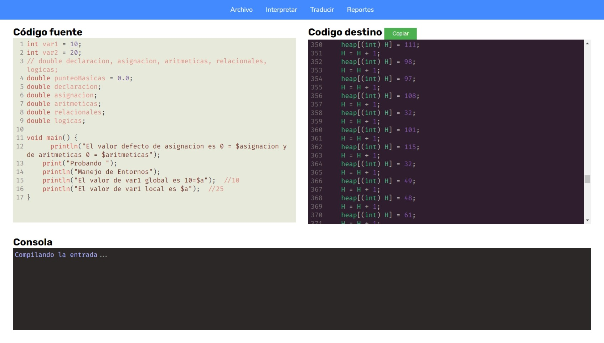
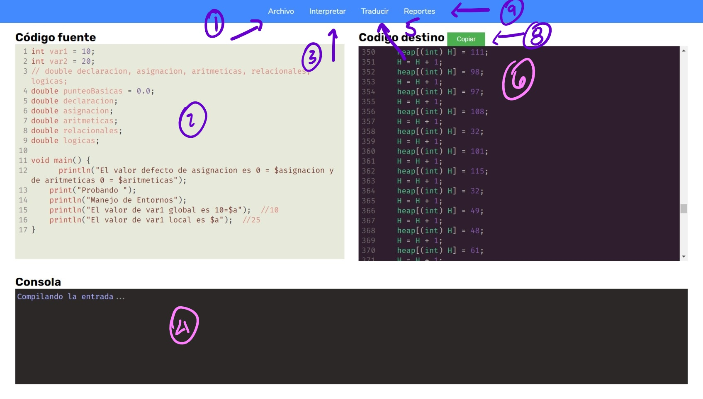
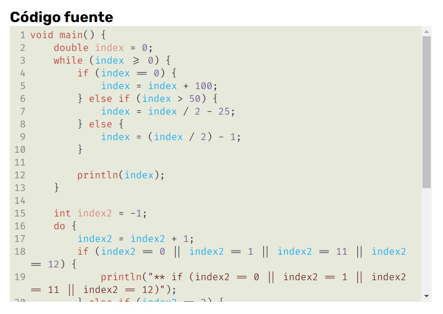
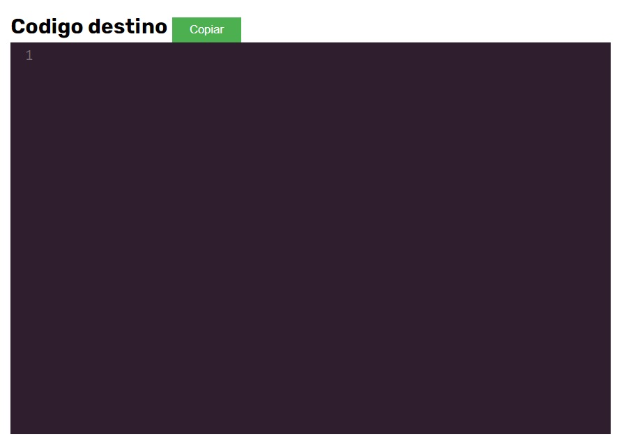
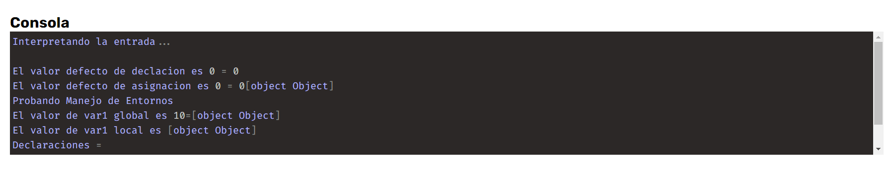

# Manual de usuario

- [Manual de usuario](#manual-de-usuario)
  - [Interfaz gráfica](#interfaz-gráfica)
    - [Área de navegación](#área-de-navegación)
    - [Área de código fuente](#área-de-código-fuente)
    - [Área de código de 3 direcciones](#área-de-código-de-3-direcciones)
    - [Área de la consola](#área-de-la-consola)
  - [Navegación](#navegación)

## Interfaz gráfica

La aplicación, cuenta con cuatro apartados:
- Navbar
- Editor de código fuente
- Caja de texto para la consola (sólo lectura)
- Editor de código destino (sólo lectura)
### Área de navegación

Los pasos para la usabilidad de la aplicación web es la siguiente:

1. Abrir un archivo preparado previamente (Si ya posee el código fuente en el portapapeles, puede avanzar al siguiente paso)
2. Observar el contenido del archivo en el editor de código fuente (Aquí puede pegar su código fuente si posee uno en el portapapeles)
3. Ir a `Interpretar` ubicado en el menú superior para proceder a interpretar el código fuente
4. Puede observar los detalles del interprete en el área de la consola
5. Proceder a `traducir` el código fuente a código de 3 direcciones
6. Puede observar el contenido de su código fuente traducido a código de 3 direcciones
7. Puede copiar el código de 3 direcciones y pegarlo en otro lado para su posterior uso
8. Aquí, puede observar los distintos reportes que se puede generar
### Área de código fuente

### Área de código de 3 direcciones

### Área de la consola

## Navegación

